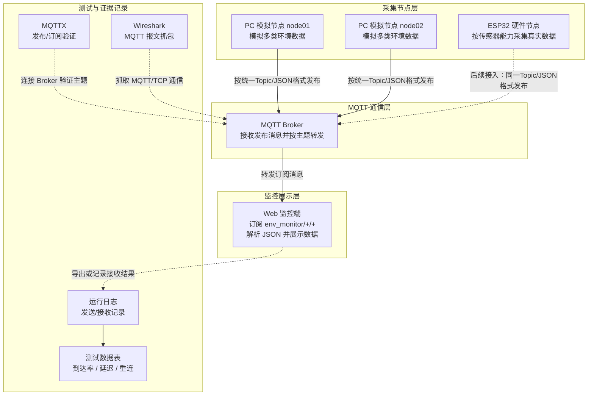

# 系统总体方案设计

## 1. 编写目的

本项目已完成《需求分析与设计指标》和《MQTT主题与消息格式设计》两份前期文档，明确了系统应用场景、功能需求、性能指标、工程约束、MQTT 主题结构和 JSON 消息格式。本文档在此基础上，从系统整体角度说明本项目的总体设计方案。

本文档用于支撑 2026-06-11 星期四课程设计中期检查，重点说明系统由哪些模块组成、各模块之间如何连接、数据如何流动、软件与硬件如何衔接，以及后续实现和测试应如何推进。

## 2. 总体设计思路

本系统采用“先软件模拟验证通信链路，再逐步接入 ESP32 硬件节点”的实现路线。这样可以先用 PC 模拟节点验证 MQTT 主题结构、消息格式、Broker 转发和 Web 监控端显示流程，降低早期硬件调试对整体进度的影响；当软件侧通信链路稳定后，再接入 ESP32 节点采集真实环境数据。总体设计中，每个节点都按统一结构发布环境数据，PC 模拟节点可模拟温度、湿度、光照、噪声等多类数据，ESP32 硬件节点则根据实际传感器能力接入一种或多种真实数据。

系统核心流程为：

```text
多节点采集/模拟数据 -> MQTT 发布 -> Broker 转发 -> Web 监控端订阅显示 -> 测试记录与工程分析
```

总体设计重点包括：

1. 使用统一的 MQTT 主题结构连接不同节点和监控端。
2. 使用统一的 JSON 消息格式保证软件节点、硬件节点和监控端字段一致。
3. 使用 Web 监控端集中展示节点编号、数据类型、数据值、单位和上传时间。
4. 使用 MQTTX、Wireshark、日志和测试表记录通信过程，为后续性能分析提供证据。
5. 在设计阶段保留扩展空间，支持后续增加更多节点和数据类型。

## 3. 系统总体架构

系统总体上由环境监测节点、MQTT Broker、Web 监控端和测试验证工具组成。第一阶段环境监测节点主要由 PC 模拟程序承担，后续可接入 ESP32 硬件节点。



架构说明：

- PC 模拟节点用于在没有硬件接入时模拟多类环境数据，每个节点都可以模拟温度、湿度、光照、噪声等数据。
- ESP32 硬件节点用于后续采集真实环境数据，可根据实际传感器能力采集一种或多种环境数据，并按相同协议格式发布。
- MQTT Broker 负责接收节点发布的数据，并转发给订阅相关主题的客户端。
- Web 监控端订阅环境监测主题，解析 JSON 消息并展示数据。
- MQTTX、Wireshark、运行日志和测试表用于验证通信过程和性能指标。

## 4. 模块划分

| 模块 | 主要组成 | 主要职责 | 输出或证据 |
| --- | --- | --- | --- |
| 数据采集模块 | PC 模拟节点、ESP32 节点、传感器 | 采集或模拟温度、湿度、光照、噪声等环境数据 | 原始环境数据、串口日志或模拟数据日志 |
| 通信发布模块 | MQTT 客户端程序 | 将环境数据封装为 JSON，并发布到指定 MQTT Topic | MQTT 发布消息、发送日志 |
| Broker 转发模块 | 本地或云端 MQTT Broker | 接收节点发布的数据，并根据订阅关系转发给监控端 | Broker 日志、连接状态 |
| 监控显示模块 | Web 监控端 | 订阅主题、解析 JSON、显示节点数据和更新时间 | 页面截图、接收日志 |
| 测试验证模块 | MQTTX、Wireshark、日志、测试表 | 验证发布订阅、抓取报文、统计到达率和延迟 | MQTTX 记录、pcap 抓包、测试数据表 |

模块之间通过 MQTT 主题和 JSON 消息格式进行连接。数据采集模块和通信发布模块通常位于节点端；Broker 转发模块位于中间通信层；监控显示模块和测试验证模块位于接收和分析侧。

## 5. 数据流向

系统数据从采集节点产生，经过 MQTT Broker 转发，最终到达 Web 监控端并形成测试证据。具体流程如下：

1. 节点产生环境数据。PC 模拟节点通过程序生成温度、湿度、光照、噪声等数据；ESP32 节点后续通过传感器采集真实数据。
2. 节点将环境数据封装为统一 JSON 消息，包含 `node_id`、`data_type`、`value`、`unit`、`timestamp`、`seq` 等字段。
3. 节点将消息发布到 MQTT Topic：

   ```text
   env_monitor/{node_id}/{data_type}
   ```

4. MQTT Broker 接收节点发布的消息，并根据订阅关系转发。
5. Web 监控端订阅：

   ```text
   env_monitor/+/+
   ```

6. Web 监控端解析 JSON 消息，显示节点编号、数据类型、数据值、单位和上传时间。
7. 测试工具记录通信过程和性能数据，例如 MQTTX 记录、Wireshark 抓包、运行日志和测试表。

示例数据流：

```text
node01 生成温度数据
-> 封装 JSON
-> 按统一 MQTT Topic 发布
-> MQTT Broker 转发
-> Web 监控端订阅并显示
-> 日志和测试表记录接收情况
```

## 6. 软硬件衔接方案

本项目采用软硬件分阶段衔接方案。

第一阶段使用 PC 模拟节点完成软件侧验证。PC 模拟节点负责周期性生成环境数据，并按统一 MQTT Topic 和 JSON 消息格式发布数据。每个 PC 模拟节点都可以模拟温度、湿度、光照、噪声等多类数据，便于后续比较不同节点的同类数据，也便于测试多节点同时上传场景。该阶段重点验证 MQTT Broker 是否能正常转发、Web 监控端是否能正确订阅和解析、测试工具是否能记录通信过程。

第二阶段接入 ESP32 硬件节点。ESP32 节点通过传感器采集真实环境数据，并继续使用与 PC 模拟节点相同的 Topic 和 JSON 格式。ESP32 节点可先接入温湿度传感器，也可以根据硬件条件继续增加光照、噪声等传感器。只要硬件节点遵守统一接口约定，Web 监控端无需关心数据来自模拟节点还是真实硬件节点，也不需要修改核心解析逻辑。

软硬件衔接的关键约束：

- 节点编号规则一致，例如 `node01`、`node02`、`node03`。
- 数据类型命名一致，例如 `temperature`、`humidity`、`light`、`noise`。
- MQTT Topic 结构一致：

  ```text
  env_monitor/{node_id}/{data_type}
  ```

- JSON 消息字段一致：

  ```text
  node_id, data_type, value, unit, timestamp, seq
  ```

这种衔接方式可以降低后续硬件接入风险，也便于比较模拟数据和真实传感器数据的差异。

## 7. 网络层次结构分析

本系统涉及典型的网络分层结构，各层作用如下：

| 网络层次 | 本项目中的体现 | 主要作用 |
| --- | --- | --- |
| 应用层 | MQTT 协议、JSON 消息、Web 监控端展示 | 定义数据发布订阅方式、消息内容和页面展示形式 |
| 传输层 | TCP | 为 MQTT 提供可靠连接，保证消息按连接传输 |
| 网络层 | IP 地址、局域网通信 | 支持节点、Broker、监控端之间通过 IP 网络互联 |
| 链路层 | Wi-Fi、本机回环网络或以太网 | 提供局域网或本机通信的数据链路 |
| 物理层 | PC、ESP32、传感器、无线网络环境 | 承载实际设备、传感器采集和无线通信 |

从课程设计角度看，系统重点体现应用层 MQTT 发布/订阅机制，同时也需要说明 MQTT 依赖 TCP 连接和 IP 网络完成数据传输。ESP32 接入后，还需要考虑 Wi-Fi 链路质量、传感器采集稳定性和设备供电等物理层约束。

## 8. 与 MQTT 主题和消息格式的关系

本总体方案直接引用《MQTT主题与消息格式设计》中的接口约定。所有节点发布数据时均采用以下 Topic 结构：

```text
env_monitor/{node_id}/{data_type}
```

所有节点发布的 JSON 消息都应包含以下字段：

```text
node_id, data_type, value, unit, timestamp, seq
```

示例：

```json
{
  "node_id": "node01",
  "data_type": "temperature",
  "value": 26.5,
  "unit": "C",
  "timestamp": "2026-06-08T22:30:00+08:00",
  "seq": 1
}
```

总体方案中的 PC 模拟节点、ESP32 硬件节点和 Web 监控端都必须遵守该接口约定。这样可以保证不同模块之间的数据结构一致，避免后续出现节点发布格式和监控端解析格式不匹配的问题。

## 9. 后续实现顺序

为降低实现风险，后续建议按以下顺序推进：

1. 搭建本地 MQTT Broker，确认 Broker 可以正常启动和监听。
2. 使用 MQTTX 验证发布和订阅流程，确认 Topic 结构可用。
3. 实现 PC 模拟节点，按固定周期发布模拟环境数据。
4. 实现 Web 监控端，订阅 `env_monitor/+/+` 并显示各节点数据。
5. 进行基础功能测试，确认多节点上传、Broker 转发和页面显示正常。
6. 接入 ESP32 硬件节点，采集真实温湿度、光照或噪声数据。
7. 开展 QoS、平均延迟、消息到达率、断线重连等测试，并整理测试证据。

该顺序先验证软件通信链路，再逐步增加硬件复杂度，符合工程实现中逐步降低风险的思路。

## 10. 测试验证思路

本阶段不记录详细测试数据，只确定后续测试方向和证据形式。

| 测试方向 | 测试目的 | 证据形式 |
| --- | --- | --- |
| 多节点同时上传测试 | 验证至少 2 个节点同时发布数据时系统能正常接收和显示 | 运行截图、接收日志 |
| MQTT 发布/订阅测试 | 验证节点发布、Broker 转发、监控端订阅流程是否正确 | MQTTX 记录、Broker 日志 |
| Web 监控端显示测试 | 验证页面是否显示节点编号、数据类型、数据值、单位和上传时间 | 页面截图 |
| 消息到达率测试 | 统计发送消息数和接收消息数，评价传输可靠性 | 测试数据表、日志 |
| 平均延迟测试 | 使用 `timestamp` 和接收时间计算传输延迟 | 测试数据表 |
| 断线重连测试 | 模拟节点或 Broker 断开后恢复，观察系统恢复能力 | 运行日志、测试记录 |
| QoS 对比测试 | 对比 QoS 0、QoS 1、QoS 2 的消息传输效果 | MQTTX 记录、Wireshark 抓包 |
| Wireshark 抓包分析 | 分析 MQTT CONNECT、PUBLISH、SUBSCRIBE 等报文过程 | pcap 文件、分析截图 |

后续测试结果应与《需求分析与设计指标》中提出的消息到达率、平均传输延迟、断线重连恢复时间、连续运行稳定性等指标对应。

## 11. 小结

本文档从整体角度说明了基于 MQTT 的多节点环境监测系统总体方案。系统采用 PC 模拟节点先行、后续接入 ESP32 硬件节点的路线，通过 MQTT Broker 实现多节点数据转发，通过 Web 监控端完成数据展示，并通过 MQTTX、Wireshark、日志和测试表保留测试证据。

该总体方案明确了系统结构、模块职责、数据流向、软硬件衔接方式和网络分层关系，可作为 2026-06-11 星期四中期检查的总体方案材料，也可作为后续 Broker 搭建、模拟节点实现、Web 监控端开发、硬件节点接入和课程设计报告撰写的依据。
